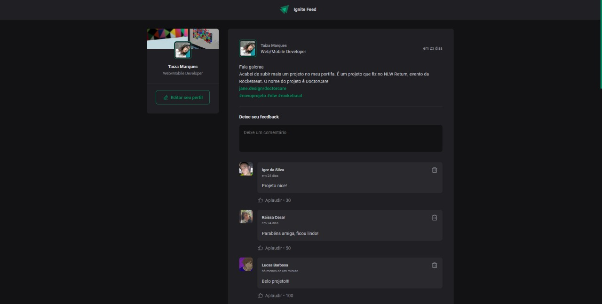

# Ignite Feed

Project developed during Ignite @Rocketseat classes

## 🛠 Skills

- Javascript
- CSS Modules
- React JS
- Vite JS

## Installation

Run my-project with npm

```bash
  git clone https://github.com/taiprogrammer/01-ignite-react.git
  cd 01-ignite-react
  npm install
  npm run dev
```

It should be running on port 5173

## Screenshots


